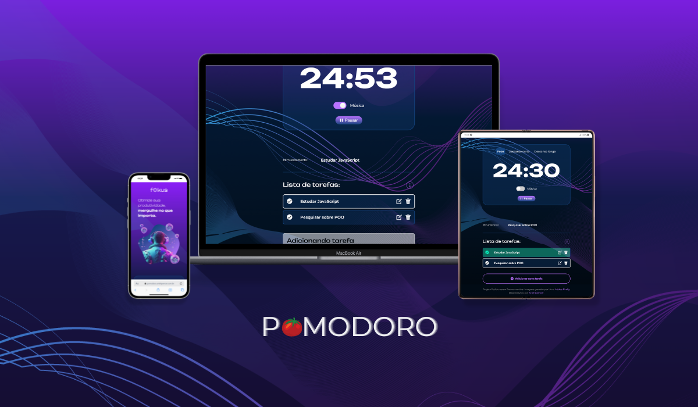

#  Fokus Pomodoro

Bem-vindo ao Fokus Pomodoro, uma ferramenta criada para aumentar sua produtividade utilizando a técnica Pomodoro. Concentre-se em tarefas importantes por períodos de tempo definidos e acompanhe seu progresso.

## Funcionalidades

- Temporizador Personalizável: Defina seus tempos de trabalho e descanso.
- Lista de tarefas: Priorize as tarefas mais importantes para concluir em cada intervalo de tempo.
- Notificações e Sons de Alerta: Receba notificações e sons quando é hora de começar ou pausar.
- Interface Intuitiva: Design simples e fácil de usar.
- Histórico de Sessões: Ao deixar o site, você não perde suas atividades, elas ficam armazenadas em seu dispositivo para que concluia em outro momento.
- Música: Foque em sua tarefa enquanto ouve sons constantes que servem para esconder ruídos externos.

## Link para o projeto
Você pode acessar o deploy do projeto em: [pomodoro.arielspencer.com.br](https://pomodoro.arielspencer.com.br)

## Como Usar
1. Defina sua lista de prioridades

2. Configurar o Temporizador:
Defina os tempos de trabalho e descanso conforme sua preferência.
Clique no botão "Iniciar" para começar sua sessão.

3. Durante a Sessão:
Foque na tarefa durante o tempo de trabalho.
Após o término do tempo de trabalho, o temporizador automaticamente concluí a tarefa em execução e você pode realizar um descanso como na técnica pomodoro.

## Contribuição

Contribuições são bem-vindas! Se você tiver sugestões, correções ou melhorias, sinta-se à vontade para abrir uma issue ou enviar um pull request.

# 👾 Tecnologias

  
  
  

# 💙 Curso e Origem
Este projeto foi desenvolvido após a conclusão dos cursos JavaScript: manipulando elementos no DOM e JavaScript: explorando a manipulação de elementos e da localStorage na Alura. Agradeço especialmente aos instrutores [Luan Alves](https://github.com/luanalvesdev) e [Vinicios Neves](https://github.com/viniciosneves) por me guiarem nessa jornada de aprendizado front-end.

# ☕️ Desenvolvido por:

| [ Ariel Spencer](https://arielspencer.com.br/) |
| :---: |

  
  

